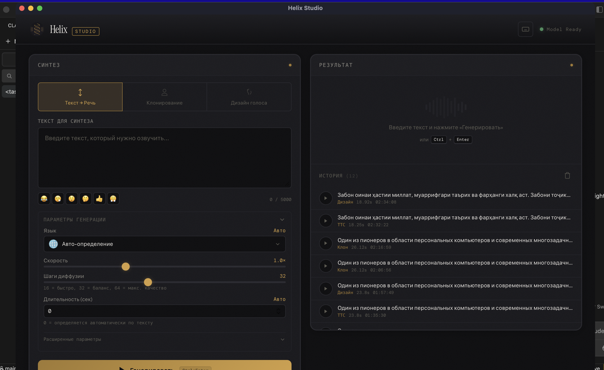

# Helix Studio

AI-приложение для синтеза речи на 600+ языках. Работает полностью локально.




## Возможности

- **Текст → Речь** — введи текст, получи аудио. 600+ языков
- **Клонирование голоса** — загрузи 3-30 сек аудио, и модель заговорит этим голосом
- **Дизайн голоса** — опиши голос текстом (пол, возраст, акцент, тон)
- **Обрезка аудио** — визуальный триммер с waveform прямо в приложении
- **Голосовые пресеты** — сохраняй и переиспользуй клонированные голоса
- **Невербальные вставки** — `[laughter]`, `[sigh]`, `[surprise-ah]` и другие
- **Расширенные параметры** — guidance scale, temperature, denoise, скорость, длительность
- **Нативное окно** — работает как обычное приложение (macOS, Windows)
- **История генераций** — все результаты сохраняются

## Платформы

| Платформа | GPU | Установка |
|---|---|---|
| **macOS** (Apple Silicon) | MPS | `./install.sh` → `.app` |
| **macOS** (Intel) | CPU | `./install.sh` → `.app` |
| **Windows** (NVIDIA) | CUDA | `run.bat` |
| **Windows** (без GPU) | CPU | `run.bat` |
| **Linux** (NVIDIA) | CUDA | `./run.sh` |
| **Linux** (без GPU) | CPU | `./run.sh` |

CUDA устанавливается автоматически при обнаружении NVIDIA GPU.
Приложение открывается в нативном окне на всех платформах.

## Быстрый старт

### macOS

```bash
git clone https://github.com/ayubjon1/helix-studio.git
cd helix-studio
./install.sh
```

Создаст приложение `Helix Studio.app` — можно перетащить в Applications.

### Windows

```
git clone https://github.com/ayubjon1/helix-studio.git
cd helix-studio
run.bat
```

### Linux

```bash
git clone https://github.com/ayubjon1/helix-studio.git
cd helix-studio
./run.sh
```

## Что происходит при первом запуске

1. Устанавливается `uv` (менеджер Python)
2. Создаётся виртуальное окружение с Python 3.12
3. Устанавливаются зависимости + PyTorch (с CUDA для NVIDIA)
4. Скачивается AI-модель (~3 ГБ)
5. Открывается приложение

Первый запуск: **5-10 минут**. Далее: **~30 секунд**.

## Горячие клавиши

| Клавиша | Действие |
|---|---|
| `Ctrl+Enter` | Генерировать |
| `Space` | Играть / Пауза |
| `1` `2` `3` | Переключение режимов |

## Удаление

**macOS:** удалить приложение + `~/Library/Application Support/Helix Studio`
**Windows/Linux:** удалить папку `helix-studio`

Модель кешируется в `~/.cache/huggingface/` — удалить при необходимости.

## Технологии

- [OmniVoice](https://github.com/k2-fsa/OmniVoice) — zero-shot TTS модель (600+ языков)
- FastAPI + pywebview — бэкенд + нативное окно
- PyTorch — инференс (MPS / CUDA / CPU)
